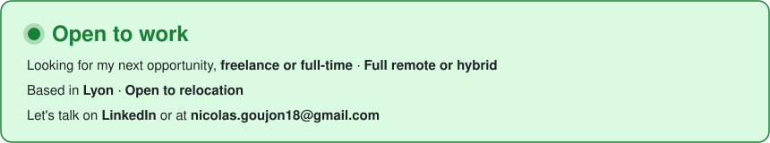

# 👋 Hi, I'm Nicolas

**Web developer based in Lyon, France** · founder of [Qwebty](https://www.qwebty.com)

I love building useful tools: web applications, native macOS apps
and AI assistants that actually get work done.

---

## 🧰 Tech stack

| Area | Tools |
| --- | --- |
| **Front** |      |
| **Back** |     |
| **macOS** |    |
| **AI** |        |
| **Infra** |      |

---

## 🚀 Featured projects

### 🤖 AI & assistants

- **[Docverse](https://github.com/ngoujon/docverse)** — Sovereign RAG: chat with your own documents (PDFs, scans, audio, web pages…) on a fully European pipeline — hosted on OVHcloud, powered by Mistral AI, with local Whisper transcription.
- **[Assistant OpenSpace](https://github.com/ngoujon/assistant-openspace)** — A macOS app that spins up a *virtual team* (orchestrator, department heads, specialists) of Claude subagents to deliver a single Markdown document.
- **[Assistant Todoist](https://github.com/ngoujon/assistant-todoist)** — A conversational macOS assistant wired to Todoist through MCP to plan your tasks.

### 🍎 Native macOS apps

- **[Sommeil](https://github.com/ngoujon/sleep-tracker)** — Turns your Apple Health export into a nightly sleep score, stress level and heart-rate trends. 100% local, documented algorithms.
- **[MultiPlash](https://github.com/ngoujon/mac-background)** — A web page as your wallpaper, a different one on every screen. Swift + AppKit, zero dependencies.

### 🎨 Web

- **[Design Systems Gallery](https://github.com/ngoujon/design-system)** — A gallery of 20 design systems, each showcased through a full demo website.
- **[nicolas-goujon.fr](https://github.com/ngoujon/nicolas-goujon)** — My professional website: React + TypeScript, Laravel contact API, Dockerized.
- **[JDR D&D](https://github.com/ngoujon/jdr-dnd)** — A tabletop role-playing side project.

---

💬 **Have a project, a role or a question?**
Reach me on [LinkedIn](https://www.linkedin.com/in/ngoujon/) or by email at [nicolas.goujon18@gmail.com](mailto:nicolas.goujon18@gmail.com) — I always reply.

